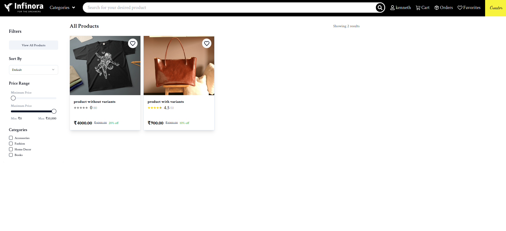
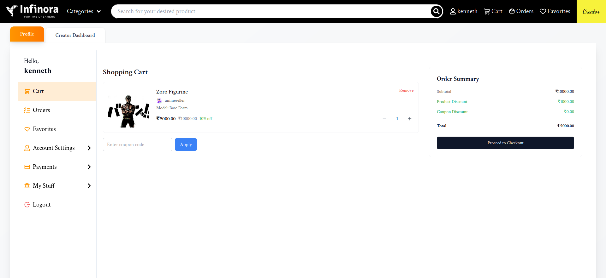
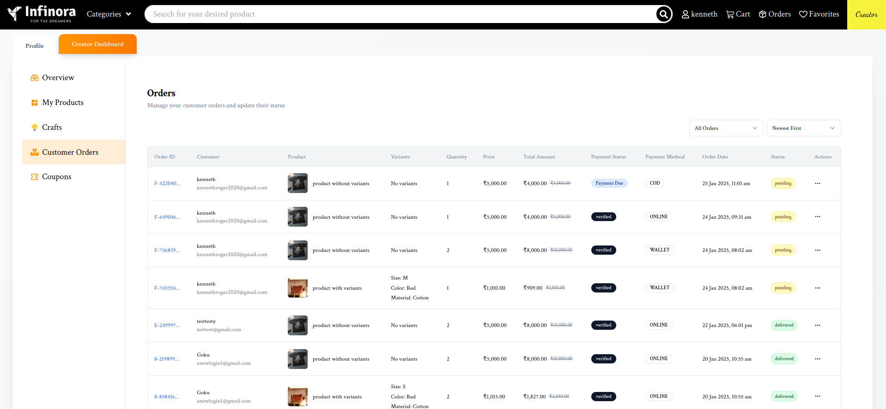
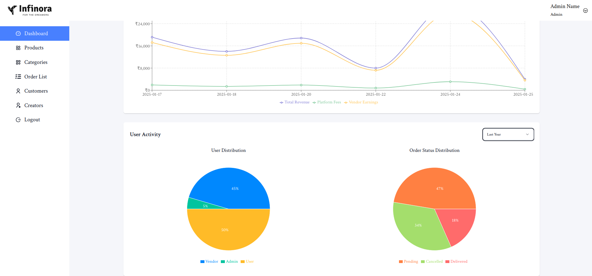
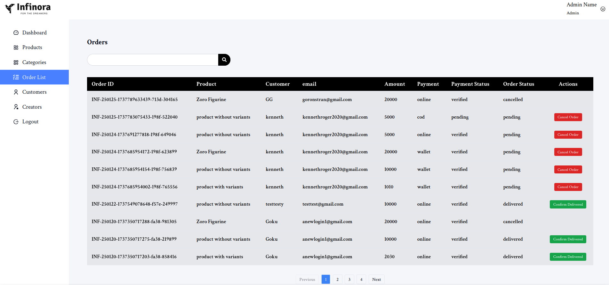

# 🛍️ Infinora – Multi-Vendor eCommerce Platform

**Infinora** is a fully functional, multi-vendor eCommerce platform built as a learning project to gain real-world, hands-on experience with the MERN stack and modern web development tools. It supports three user roles — **User**, **Vendor**, and **Admin** — and includes a range of advanced eCommerce features.

---

## 🚀 Tech Stack

- **Frontend:** React, Redux, Firebase (for authentication & hosting assets)
- **Backend:** Node.js, Express.js, MongoDB
- **Payments:** Razorpay integration for secure checkout
- **Hosting:** Vercel (frontend), Render (backend)

---

## ✨ Features

- 🔒 Secure user authentication (Firebase)
- 🛍️ Multi-vendor product management
- 🔁 Add products with multiple variants (size, color, etc.)
- 💳 Razorpay-based secure checkout flow
- 🛠️ Admin panel for user/product management
- 🌐 Fully responsive UI — custom-designed from scratch
- 📦 Order tracking and status updates

---

## 🖼️ UI Screenshots

### 👤 User Interface

**Home Page**  

**Search Page**  

**Cart Page**  

---

### 🧑‍💼 Vendor Dashboard

**Vendor Dashboard Page**  

---

### 🛠️ Admin Panel

**Admin Dashboard Page**  

**Order List Page**  

---

## 🔧 In Progress

I'm currently working on an **Item Request & Custom Order Workflow**, where:
- Users can request custom products
- Vendors can communicate via chat and share design demos
- Funds are held in escrow on the platform until delivery confirmation

---

## 📂 Project Structure (Optional)

You can add a code structure section here later if needed.

---

> 💬 Feel free to explore, fork, and suggest improvements. Feedback is welcome!

